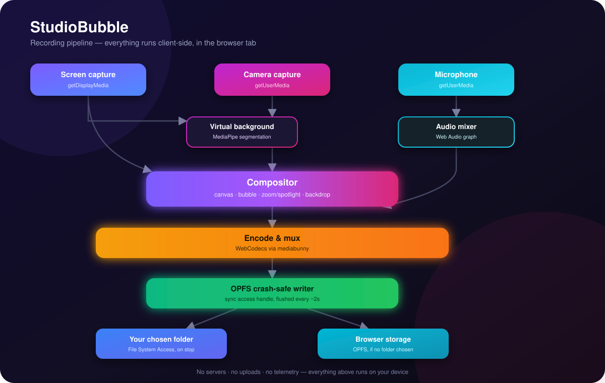

# StudioBubble

A recording studio in a browser tab, 100% local. Screen recording with a studio-quality,
draggable camera bubble — built with React + Vite + TypeScript as a from-scratch,
similarly-scoped project inspired by [framecast](https://github.com/nathan-fiscaletti/framecast).

Everything runs on-device: capture, compositing, encoding/muxing (via [mediabunny](https://mediabunny.dev)),
and export. Nothing is uploaded anywhere.



## Features

- **Layouts**: screen + camera bubble, screen only, camera only
- **Camera bubble**: circle/rounded, draggable, snap-to-corner (keys `1`–`4`), size + zoom-crop slider
- **Virtual background**: blur your room or replace it with a curated backdrop, powered by MediaPipe
  selfie segmentation (GPU delegate with CPU fallback), with Auto/High/Balanced/Lite quality tiers
- **Scene framing**: wrap the recording in a padded, rounded, shadowed card over a curated backdrop
  (gradients, solids, or a content-aware blur of the screen itself)
- **Live zoom & spotlight**: drag on the stage to punch into a region or dim everything outside it,
  baked into the recording as you go; `Esc`/`0` resets
- **Crash-safe recording**: composites to canvas, encodes with WebCodecs (via mediabunny), and streams
  directly to an OPFS file from a dedicated worker holding a `FileSystemSyncAccessHandle` — writes are
  flushed every few chunks, so a renderer crash mid-take leaves a recoverable file
- **Mic controls**: device picker, live level meter, noise suppression / echo cancellation / auto-gain
- **Pause/resume**, 3-2-1 countdown, keyboard shortcuts (`Space` pause, `S` stop, `M` mic, `C` bubble,
  `1`-`4` snap corners, `Esc`/`0` reset zoom)
- **Floating control deck** via the Document Picture-in-Picture API (Chrome/Edge), with graceful
  fallback when unsupported
- **Review screen**: trim, export to MP4/WebM/MOV, and a simplified one-click "audio enhance" pass
- **Recordings library**: reads from a folder you choose (File System Access API) or from local
  browser storage (OPFS) if you skip that step
- **Light/dark theme**, installable PWA, fully offline after first load

## Quick start

```bash
npm install
npm run dev
```

Open the printed `localhost` URL in **Chrome or Edge 122+** — StudioBubble uses Chrome-only APIs
(WebCodecs, OPFS sync access handles, `requestVideoFrameCallback`, File System Access, and
optionally Document Picture-in-Picture for the floating deck).

```bash
npm run build     # type-checks (tsc -b) and produces dist/
npm run lint      # oxlint
npm run preview   # serve the production build locally
```

macOS asks for the *Screen Recording* permission on first capture (System Settings → Privacy &
Security → Screen Recording → enable your browser, then restart it).

## How it stays local

| Stage | What happens | Where |
|---|---|---|
| Capture | `getDisplayMedia` + `getUserMedia` | Chrome |
| Compositing | a 2D canvas, redrawn every frame via `requestVideoFrameCallback` (keeps running in backgrounded tabs, unlike `requestAnimationFrame`) | your CPU/GPU |
| Virtual background | MediaPipe selfie segmentation (WASM/GPU) | your device |
| Encoding & muxing | WebCodecs + mediabunny, writing a fragmented MP4 incrementally | your CPU/GPU |
| Crash-safe storage | OPFS `FileSystemSyncAccessHandle` in a dedicated worker, flushed every few writes | your SSD |
| Promotion | on stop, the OPFS take is copied into your chosen folder (File System Access) | your disk |
| Trim / convert / enhance | mediabunny `CanvasSink` + `AudioSampleSink`/`AudioSampleSource`, re-encoding locally | your CPU/GPU |

No servers, no uploads, no telemetry.

## Deploy

StudioBubble is a static site — no backend, no database, no environment variables. Any static
host works; pick whichever you already use.

| Target | How |
|---|---|
| **Vercel** | Import the repo at [vercel.com/new](https://vercel.com/new) — `vercel.json` is already configured (Vite preset, SPA rewrite). |
| **Netlify** | Import the repo at [app.netlify.com/start](https://app.netlify.com/start) — `netlify.toml` sets the build command and publish dir. |
| **GitHub Pages** | Push to `main` — `.github/workflows/deploy-pages.yml` builds and deploys automatically. If you're serving from `<user>.github.io/<repo>` rather than a custom domain, uncomment the `--base=/<repo>/` line in the workflow. |
| **Docker / self-host** | `docker build -t studiobubble . && docker run -p 8080:80 studiobubble` — builds with Node, serves the static output with nginx. |

Because capture APIs (`getDisplayMedia`, `getUserMedia`, File System Access) require a secure
context, everything above works out of the box (all four give you HTTPS or `localhost`) —
there's nothing extra to configure for that.

## Releases

See [CHANGELOG.md](./CHANGELOG.md) for full release notes.

- **v0.2.0** — virtual backgrounds (blur/replace), live zoom & spotlight, scene framing, the
  floating Document PiP deck, and review-screen trim/convert/audio-enhance.
- **v0.1.0** — the initial local-first recording loop: layouts, the draggable camera bubble,
  crash-safe OPFS recording, mic controls, and a basic library.

## Honest differences from framecast

This project reproduces framecast's feature *set*, but a few pieces are intentionally simplified
rather than reverse-engineered line-for-line:

- **Compositing** runs on the main thread (canvas + `requestVideoFrameCallback`) rather than in an
  `OffscreenCanvas` + Web Worker pipeline fed by `MediaStreamTrackProcessor`. This is simpler to
  reason about and still keeps compositing alive in backgrounded tabs, but is less isolated from
  main-thread jank than a full worker pipeline.
- **Virtual background** uses a single MediaPipe selfie-segmentation model with a GPU→CPU delegate
  fallback and frame-skipping by quality tier, rather than a tiered matting engine (RobustVideoMatting
  on WebGPU + guided CPU refinement). Edge quality is noticeably lower than a true matting model,
  especially around hair.
- **Audio enhance** is a peak-based gain normalizer plus a one-pole high-pass rumble filter, not a
  neural RNNoise denoiser or a true BS.1770 loudness measurement. It's a real, working pass — just a
  simpler one.
- **Trim UI** uses two range sliders rather than a filmstrip with draggable thumbnail handles.

Everything else — layouts, the draggable/zoomable bubble, scene framing, live zoom/spotlight,
crash-safe OPFS recording, the recordings library, the floating Document PiP deck, keyboard
shortcuts, PWA installability — is a genuine, working implementation, not a stub.

## Project structure

```
src/
  lib/                 capture, compositing/recording engine, segmentation, export, OPFS storage
  hooks/                media devices, keyboard shortcuts, Document PiP
  components/           Setup / Recording / Review / Library screens, floating deck, UI bits
  state/store.ts        zustand store for settings + session state
  types.ts               shared types, quality presets, curated backdrops
```

## License

MIT. Bundles [mediabunny](https://github.com/Vanilagy/mediabunny) (MPL-2.0) and
[@mediapipe/tasks-vision](https://github.com/google-ai-edge/mediapipe) (Apache-2.0) as dependencies.
